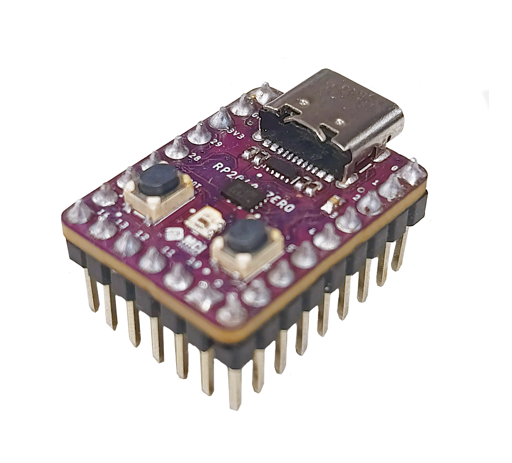
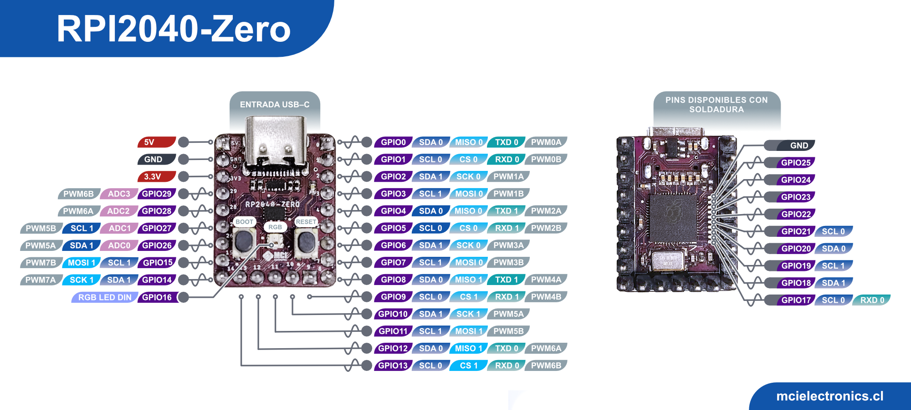

# MCI10790 - Rpi 2040 Zero



Rpi2040-Zero es una tarjeta de desarrollo compacta manejada por el microcontrolador de Raspberry RP2040, alimentada por una entrada tipo C. Su diseño permite acceder a todos los pines no utilizados de la RP2040. 
Tiene 20 pines, además de un pin de 5V, 3.3V y GND.

## Características principales
- Alimentación de 5V
- Salida de 3.3V
- Utiliza el microcontrolador RP2040, oficialmente diseñado por Raspberry Pi
- Procesador de doble núcleo de hasta 133MHz.
- 264 KB RAM y 2MB en memoria Flash.
- Conector USB–C para conectividad moderna y fácil de usar.
- Conexiones en el borde, facilitando su soldadura en PCBs personalizadas
- Compatibilidad con host y dispositivos USB 1.1
- Modos de suspensión y de inactividad de bajo consumo
- Programación Drag-and-drop (arrastrar y soltar) a través de almacenamiento USB
- 29 pins GPIO desde RP2040
- 20 pins disponibles mediante headers
- Los pines restantes son accesibles mediante soldadura
- Amplio conjunto de periféricos de hardware
- 2 Pines SPI
- 2 Pines I2C
- 2 Pines UART
- 4 Pines de 12-bit ADC
- 16 Pines PWM channels
- Reloj y minutero integrado preciso
- Sensor de temperatura integrado
- Biblioteca de punto acelerado flotante integrada
- 8 máquinas de estado I/O programables para implementos periféricos personalizados

## Pins



## Empezando a usar RPI 2040 Zero

### Requerimientos de hardware
- Computador
- Cable USB-C
- 1 LED
- 1 Resistencia de 330Ω
- Cables

### Requerimientos de software
- [Thonny](https://thonny.org/)

## Ejemplo 1: Blink

### Conexiones


### Código

```python
import time
from machine import Pin

led= Pin(3, Pin.OUT)

while True:
    led.value(0)        #Apaga led
    time.sleep_ms(500)
    led.value(1)        #Enciende led
    time.sleep_ms(500)
```

## Ejemplo 2: Ciclo de color del LED RGB integrado

### Conexiones

Al usar el LED integrado de la tarjeta, no se necesita ningún otro componente

### Código

```python
import time
from machine import Pin
import rp2

max_lum =100
r=0
g=0
b=0

@rp2.asm_pio(sideset_init=rp2.PIO.OUT_LOW, out_shiftdir=rp2.PIO.SHIFT_LEFT, autopull=True, pull_thresh=24)
def ws2812():
    T1 = 2
    T2 = 5
    T3 = 3
    wrap_target()
    label("bitloop")
    out(x, 1)               .side(0)    [T3 - 1]
    jmp(not_x, "do_zero")   .side(1)    [T1 - 1]
    jmp("bitloop")          .side(1)    [T2 - 1]
    label("do_zero")
    nop()                   .side(0)    [T2 - 1]
    wrap()

sm = rp2.StateMachine(0, ws2812, freq=8_000_000, sideset_base=Pin(16))
sm.active(1)

while True:
    for i in range(0,max_lum):
        r=i
        b=max_lum-i
        rgb =(g<<24) | (r<<16) | (b<<8)
        sm.put(rgb)
        time.sleep_ms(10)
    time.sleep_ms(300)
    for i in range(0,max_lum):
        g=i
        r=max_lum-i
        rgb =(g<<24) | (r<<16) | (b<<8)
        sm.put(rgb)
        time.sleep_ms(10)
    time.sleep_ms(300)
    for i in range(0,max_lum):
        b=i
        g=max_lum-i
        rgb =(g<<24) | (r<<16) | (b<<8)
        sm.put(rgb)
        time.sleep_ms(10)
    time.sleep_ms(300)
```
